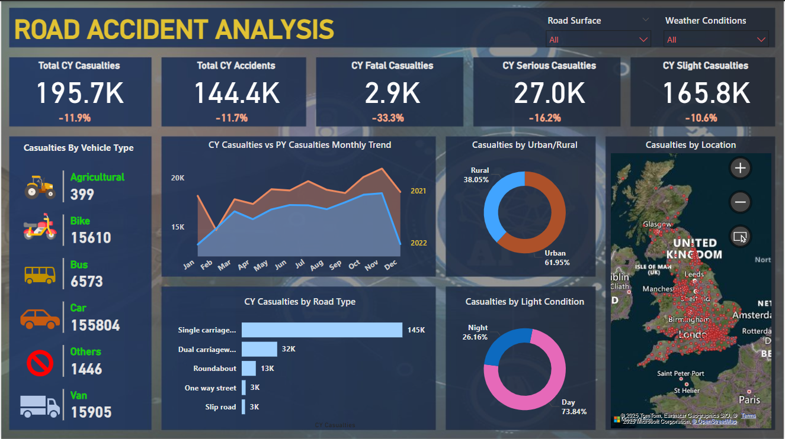

# 🚧 Road Accident Analysis Dashboard – Power BI

This project presents an interactive Power BI dashboard analyzing road accident data across the United Kingdom. The goal is to explore patterns in casualties and accidents by various dimensions such as vehicle type, road type, light conditions, and geography.

---

## 📊 Key Metrics

- **Total Casualties (CY):** 195.7K ↓ 11.9%
- **Total Accidents (CY):** 144.4K ↓ 11.7%
- **Fatal Casualties:** 2.9K ↓ 33.3%
- **Serious Casualties:** 27K ↓ 16.2%
- **Slight Casualties:** 165.8K ↓ 10.6%

---

## 🔍 Key Insights & Features

- 📉 **Casualty Trends:** Monthly trend comparison of current vs previous year
- 🚗 **By Vehicle Type:** Car, Bike, Bus, Van, Agricultural, and Others
- 🛣️ **By Road Type:** Carriageways, Roundabouts, Slip Roads, One-Way Streets
- 🌆 **Urban vs Rural** distribution
- 💡 **Day vs Night** accident conditions
- 🗺️ **Geographic View:** Location-level mapping of accidents across the UK
- 🎛️ **Interactive Filters:** Road surface, weather conditions, and more

---

## 🖼️ Dashboard Preview

---

## 📁 Project Structure

road-accident-analysis/
├── Road_Accident_Analysis.pbix # Power BI file
├── README.md # Project overview
└── screenshots/
└── dashboard-preview.png # Dashboard image

---

## 📌 Tools Used

- **Power BI Desktop**
- **Data Visualization & DAX**
- **Geo-mapping using Bing Maps**
- **Custom filters and slicers**

---

## 💼 Use Case

This dashboard can be used by:
- Transport departments for safety planning
- City planners analyzing risk zones
- Researchers studying traffic safety trends
- Portfolio/demo for data analyst interviews

---

## 🔗 Live Repository Link

Explore the full project on GitHub:  
**[https://github.com/KhushiTripathi21/road-accident-analysis](https://github.com/KhushiTripathi21/road-accident-analysis)**

---

## 🙋‍♀️ Author

**Khushi Tripathi**  
[LinkedIn](https://www.linkedin.com/posts/khushi-tripathi-b9a64125a_powerbi-dashboarddesign-dataanalytics-activity-7333143953656926208-iME1?utm_source=share&utm_medium=member_desktop&rcm=ACoAAD_PeWYBZlkl5Vi9NBj4106xDqBMLvYlZ4Q) • [GitHub](https://github.com/KhushiTripathi21)

---

## 📄 License

This project is open-source and available under the [MIT License](LICENSE).
